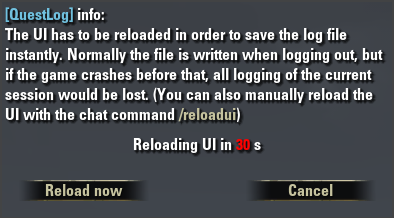
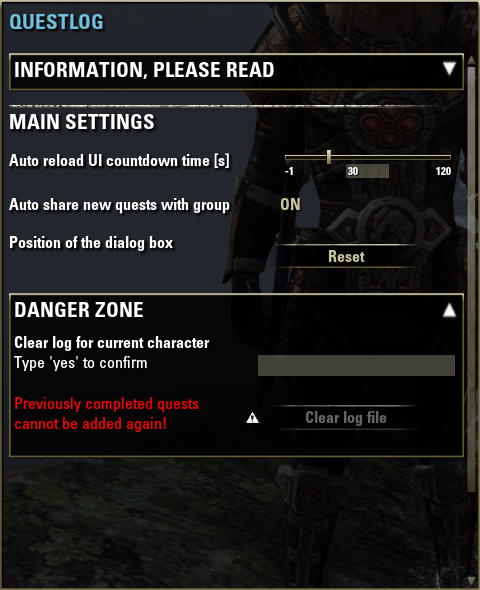

# ESO_QuestLog

## Note: With the new API update it is possible to get a full list of completed quests. So this addon is outdated. Check out my new one: "Quest Map"

This addon logs your quest progress (started/abandoned/completed) and saves it to following file:
`Elder Scrolls Online\live<eu>\SavedVariables\QuestLog.lua`

Example log:

```
["2015-02-07 23:07:37.643"] = "Quest complete: Taking the Undaunted Pledge @ Elden Root (57.5, 66.4)",
["2015-02-08 12:50:40.649"] = "Quest added: The Broken Spearhead @ Daggerfall Trade District (66.2, 63.8)",
["2015-02-08 13:15:01.462"] = "Quest added: Goblin Marq @ Stros M'Kai (55.4, 29.1)",
["2015-02-08 13:15:19.453"] = "Quest abandoned: Goblin Marq",
```

---
Note: The UI has to be reloaded in order to save the log file instantly. Normally the file is written when logging out, but if the game crashes before that, all logging of the session would be lost.
Because of that, QuestLog will display a dialog box with a countdown when you complete a quest. When the countdown runs out, the UI will be reloaded automatically. The dialog box also gives you the option to reload the UI instantly or to cancel the countdown.



If you have [LibAddonMenu-2 (LAM2)](http://www.esoui.com/downloads/info7-LibAddonMenu.html) installed (either in another addon or seperately), you can change the following settings:

- Disable / enable auto reload UI
- Countdown time for the auto reload dialog box
- Disable / enable auto share quest with group

It is however not necessary to have LAM2 if you only want to use the default settings.



This addon will never reload the UI while the player is busy (in combat/dialog/menu), it will wait until player is ready!

You can always manually reload the UI with the chat command `\reloadui`